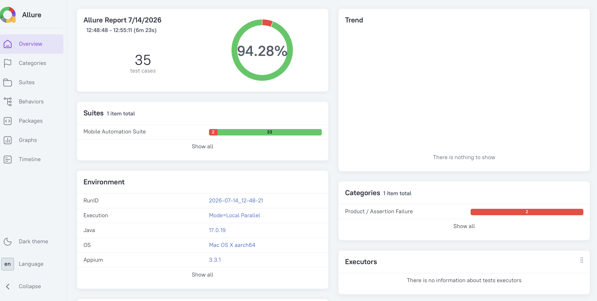
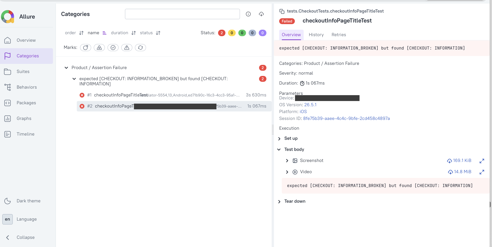
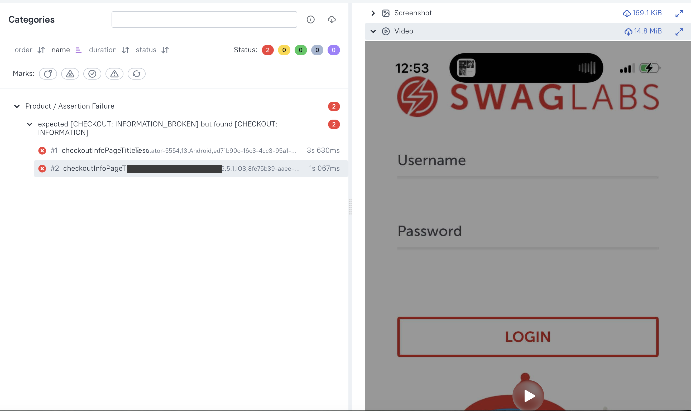
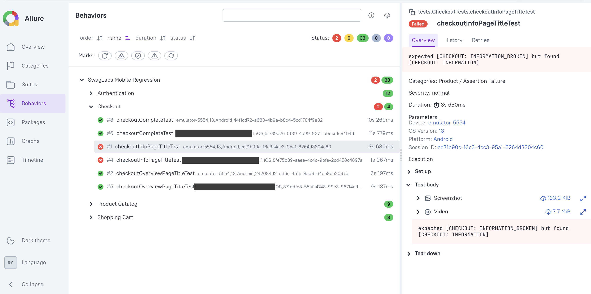

# Appium Test Automation Framework (TestNG)

A TestNG-based mobile test automation framework for Android and iOS, designed around maintainability, parallel execution, observability, and reliable failure investigation.

> This repository is a portfolio-oriented framework project. It demonstrates architecture and engineering decisions rather than providing a universal clone-and-run starter kit.

---

## Design Goals

This framework was designed to make each execution:

- isolated from previous runs,
- observable through structured logs,
- traceable by device, platform, thread, and Appium session,
- easy to diagnose with screenshots, videos, and Allure evidence,
- maintainable through clear separation of responsibilities,
- executable independently from the IDE through Maven.

The project focuses not only on **running mobile tests**, but also on making failures understandable.

---

## Core Capabilities

- Android and iOS automation with Appium
- TestNG-based test execution
- Parallel Android and iOS execution on real devices, emulators, and simulators
- Thread-safe driver management
- Programmatic Appium server lifecycle
- Page Object Model
- Structured logging and run-specific execution artifacts
- Allure reporting with metadata, attachments, and categorization
- CI-friendly execution: a single self-contained `mvn test` entry point with no external server or IDE dependency
- Clean separation between framework infrastructure, pages, tests, listeners, and utilities

---

## Design Principles

### 1. One execution, one context

Every execution receives a unique run ID.

`RunContext` is the single source of truth for all generated output paths:

```text
test-output/
└── <run-id>/
    ├── logs/
    │   ├── suite.log
    │   ├── android-execution.log
    │   ├── ios-execution.log
    │   └── appium-server.log
    ├── screenshots/
    │   ├── android/
    │   └── ios/
    ├── videos/
    │   ├── android/
    │   └── ios/
    └── allure-results/
```

This prevents artifacts from different runs being appended, overwritten, or mixed together. Without this shared context, each component would calculate its own paths independently, causing inconsistent timestamps, duplicated path-building logic, and evidence that cannot be attributed to a specific run.

---

### 2. Parallel execution without shared driver state

Drivers are managed through a thread-local driver layer.

Each TestNG execution thread works with its own driver instance and session context. Android and iOS tests can therefore run in parallel on any combination of real devices, emulators, and simulators, without sharing mutable driver state.

The framework keeps driver creation, storage, retrieval, and cleanup outside test classes.

---

### 3. Observability by Design

Logging and artifacts are not treated as afterthoughts.

Execution logs include contextual information such as:

- platform,
- device identifier,
- Appium session ID,
- TestNG thread,
- timestamp,
- log level,
- source class.

How these logs are routed — per platform, per run, and separately from the Appium server's own log — is covered under Important Engineering Decisions.

---

### 4. Separation of Concerns

Test classes focus on test intent.

Infrastructure responsibilities are delegated to dedicated components:

- `DriverFactory` creates platform-specific drivers.
- `DriverManager` manages thread-local driver access.
- `AppiumServerManager` controls the local Appium server.
- `RunContext` manages run-specific output paths.
- TestNG listeners manage execution lifecycle, logging, reporting, and evidence.
- Page Objects encapsulate application interaction.
- Test utilities manage screenshots and recordings.

This separation reduces coupling and makes future changes easier to contain.

---

## High-Level Architecture

```text
Maven / TestNG
      │
      ▼
ExecutionLifecycleListener
      │
      ├── initializes RunContext and run directories
      ├── reconfigures Log4j2 with the run ID
      └── copies Allure categories configuration
      │
      ▼
BaseTest @BeforeSuite
      │
      ▼
AppiumServerManager
      │
      ├── starts one local Appium server
      └── (then) run-level Allure environment data is written
      │
      ▼
BaseTest / DriverFactory
      │
      ├── AndroidDriver
      └── IOSDriver
      │
      ▼
DriverManager
      │
      └── thread-local driver access
      │
      ▼
Page Objects
      │
      ▼
TestNG Test Classes
      │
      ▼
Listeners
      ├── execution logging
      ├── suite summary
      ├── Allure lifecycle integration
      ├── failure screenshot
      └── failure video
```

---

## Important Engineering Decisions

### Why start Appium programmatically?

The local Appium server is managed by the test lifecycle instead of requiring a manually started terminal process.

This provides:

- predictable server startup,
- a known server URL,
- automatic shutdown,
- a run-specific Appium server log,
- fewer manual preconditions before execution,
- a self-contained entry point: because the suite owns the entire server lifecycle, the same `mvn test` command can run unchanged in a future CI environment without an externally managed Appium process.

A single Appium server is used for the current parallel Android and iOS execution model.

---

### Why route logs by platform and execution context?

Parallel execution makes a single interleaved log nearly useless: Android and iOS events mix, and infrastructure noise buries test intent.

The framework routes log events by execution context instead:

- Each driver thread stamps its log events with platform, device identifier, and Appium session ID (Log4j2 `ThreadContext`).
- A routing appender writes Android and iOS execution logs to separate files based on that context.
- Suite-level lifecycle messages, which occur outside any platform context, go to `suite.log`.
- The Appium server writes to its own log, because framework-level events and Appium / ADB / WebDriverAgent internals serve different diagnostic layers.

Most failures can be investigated from the platform execution log first. The server log is used when deeper infrastructure diagnosis is required.

---

### Why a fresh driver and session per test?

Each test method receives a newly created driver and Appium session, and the session is closed when the test finishes.

This is a deliberate trade-off. It is slower than reusing one session across a test class, but in return:

- no UI state, permissions, or app data leak from one test into the next,
- every failure can be reproduced by running that single test in isolation,
- failure evidence (screenshot, video, session ID) always belongs to exactly one test.

Application state needed by a test — for example, a logged-in user with an item in the cart — is prepared explicitly during test setup, not inherited from a previous test.

---

### Why explicitly assign session ports?

A single Appium server hosts both platform sessions, but every port-sensitive subsystem is pinned explicitly:

- UiAutomator2 communicates over a dedicated `systemPort`,
- WebDriverAgent uses a dedicated `wdaLocalPort`,
- the iOS video stream uses a dedicated `mjpegServerPort`.

Explicit port assignment keeps the parallel sessions deterministic and collision-free, and extending the setup to more devices only requires assigning additional port offsets.

---

### Why platform-aware Page Objects instead of per-platform class hierarchies?

Each page is a single class that serves both platforms. Platform differences are absorbed at the locator level — dual Android/iOS locator annotations on the same element field, with explicit branching only where the page structure genuinely differs.

The alternative — separate Android and iOS page hierarchies — would double the maintenance surface and let the two implementations drift apart.

---

### Why use a custom Allure listener?

The framework stores Allure results under:

```text
test-output/<run-id>/allure-results/
```

instead of the default project-root `allure-results/` directory.

A custom `AllureRunListener` injects an `AllureLifecycle` configured with a `FileSystemResultsWriter` pointing to the active run directory.

This avoids moving report files after execution and preserves run isolation from the moment result files are created.

The standard SPI-loaded `AllureTestNg` listener is skipped to prevent a second lifecycle from also writing results to the project root.

Run-isolated Allure results are not a configuration option — they required understanding when the Allure lifecycle is created, cached, and discovered, which is exactly the kind of problem this framework was built to explore.

---

## Allure Reporting

Each run produces its own Allure result set.

The following screenshots were generated from actual executions of the framework.



### Run-level environment information

The report includes stable execution information such as:

- Run ID
- Java version
- operating system
- execution mode
- configured platforms
- configured Android device
- configured iOS device
- Appium version

### Test-level parameters

Each test result includes:

- Platform
- Device
- OS Version
- Session ID

These values are attached to the actual test case rather than to its setup fixture.

### Failure evidence

Failed tests may include:

- failure screenshot,
- failure video,
- original exception and stack trace.

Attachment failures are handled defensively so they do not replace or hide the original test failure.

Evidence is attached through the Allure runtime API, reusing the screenshot and video files already created by the artifact layer instead of generating duplicate files only for the report. Test classes remain free of reporting code.





### Failure categories

Custom Allure categories distinguish common failure types:

- `Infrastructure / Appium Session`
- `Automation / Element Interaction`
- `Product / Assertion Failure`

The categories configuration is copied into each run-specific Allure results directory at the start of each run.

### Behaviors hierarchy

The current suite is grouped under:

```text
Epic: SwagLabs Mobile Regression
```

Features include:

- Authentication
- Product Catalog
- Shopping Cart
- Checkout

Severity is applied selectively to the most important flows rather than to every test.



### Step granularity

The framework intentionally avoids turning every click, wait, and text entry into a report step. Low-level step instrumentation makes reports noisy without adding diagnostic value. The report emphasizes test outcomes, platform and session context, failure stack traces, screenshots, videos, and failure categories instead.

---

## Test Application

The framework was developed and validated against the Android and iOS versions of the Sauce Labs Swag Labs sample application.

The framework does not install the application. It expects the app to already be installed on the target Android and iOS devices and starts it using:

- Android package and activity identifiers,
- the iOS bundle identifier.

The Swag Labs application is published in the archived [saucelabs/sample-app-mobile](https://github.com/saucelabs/sample-app-mobile) repository. The Android APK is available directly from its releases; the iOS version is no longer maintained and must be built and signed from source to run on a physical device.

The framework itself is application-agnostic. The app under test is defined entirely by configuration, and all application-specific knowledge is isolated in the Page Objects and test data. Adapting the framework to a different application means supplying new identifiers, page objects, and test data — the driver management, server lifecycle, logging, artifact, and reporting layers remain unchanged.

---

## Test Coverage

The current parallel regression suite contains **35 test executions**:

- 16 Android executions
- 19 iOS executions

The difference is intentional: three scenarios are currently executed only on iOS, so the platform totals are not symmetrical.

The suite covers the main Swag Labs flows:

- authentication,
- product catalog validation,
- cart operations,
- checkout information,
- checkout completion,
- selected negative and access-control scenarios.

---

## Configuration Model

Runtime configuration is intentionally separated from framework code.

The current project uses configuration entries such as:

```properties
androidUdid=YOUR_ANDROID_DEVICE_ID
iOSUdid=YOUR_IOS_DEVICE_UDID
iOSXcodeOrgId=YOUR_APPLE_TEAM_ID
nodePath=/path/to/node
appiumMainJsPath=/path/to/appium-main.js
```

Platform name and platform version are provided through TestNG suite parameters rather than through these property keys.

Repository-safe example files should contain placeholders only. Real device identifiers, signing details, local executable paths, and secrets must remain outside version control.

The example configuration files in the repository are the source of truth for the currently supported keys.

---

## Execution

The framework is executed through Maven:

```bash
mvn test
```

Maven Surefire uses the TestNG suite configuration defined by the project.

Before execution, the local environment must already provide:

- Java,
- Maven,
- Node.js,
- Appium,
- installed Appium drivers,
- Android SDK and ADB,
- Xcode tooling for iOS,
- configured Android and/or iOS devices,
- the Swag Labs application pre-installed on those devices,
- valid local configuration values.

Generated execution output is written under the run-specific `test-output/<run-id>/` directory.

### Generating the Allure report

```bash
allure generate test-output/<run-id>/allure-results \
  -o test-output/<run-id>/allure-report --clean
allure open test-output/<run-id>/allure-report
```

The generated HTML report is not committed to Git.

---

## Repository Scope, Limitations, and Future Adaptation

This repository demonstrates a working framework architecture validated in a specific local Android and iOS environment.

It intentionally does not include:

- application binaries,
- real device identifiers,
- Apple signing credentials,
- secrets,
- generated execution artifacts,
- a cloud device provider integration,
- a CI/CD pipeline,
- guaranteed compatibility with every local setup.

The driver and configuration layers deliberately keep device selection, capabilities, and endpoints behind configuration, so the same framework can host remote execution or cloud device providers without redesigning the core architecture. No provider-specific integration is implemented in this version.

---

## Repository Structure

```text
.
├── README.md
├── LICENSE
├── pom.xml
├── testng.xml
├── docs/
│   └── images/
└── src/
    ├── main/
    │   └── resources/
    │       ├── config.properties.example
    │       ├── secrets.properties.example
    │       └── log4j2.xml
    └── test/
        ├── java/
        │   ├── listeners/
        │   ├── pages/
        │   ├── qa/
        │   ├── tests/
        │   └── utils/
        └── resources/
            ├── allure/categories.json
            └── testdata/
```

| Package | Responsibility |
|---|---|
| `listeners` | TestNG lifecycle: logging, suite summary, Allure integration, failure evidence |
| `pages` | Page Objects encapsulating platform-aware UI interaction |
| `qa` | Framework infrastructure: BaseTest, RunContext, Appium server, driver factory/manager |
| `tests` | TestNG test classes grouped by feature |
| `utils` | Test data readers, screenshot and recording utilities |

Generated output, local configuration, secrets, and IDE-specific files are excluded through `.gitignore`.

---

## Technology Stack

- Java 17
- Appium Java Client
- Appium Server 3
- Selenium (WebDriver API)
- TestNG
- Maven
- Log4j2
- SLF4J
- Allure TestNG
- UiAutomator2
- XCUITest

Exact dependency and plugin versions are defined in `pom.xml`.

---

## License

This project is licensed under the [MIT License](LICENSE).

---

## Author

**Engin Başaran**
Senior Software QA & Test Automation Engineer
